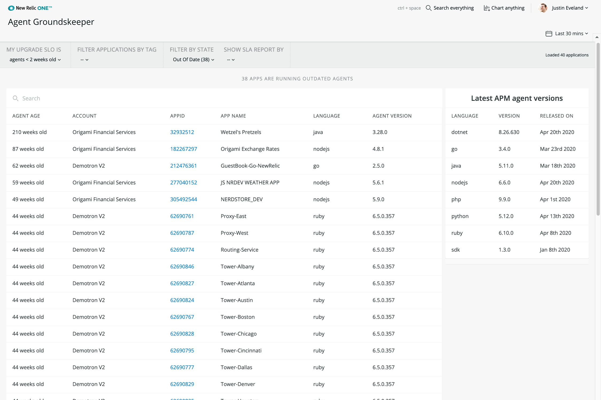

# Agent Groundskeeper

  

## Usage

**Note:** Version 2.6 with Distributed Tracing ingest estimator available now.

**Note:** Version 2 available now! Find out [what's new](./v2-whats-new.md) in v2.

Agent Groundskeeper allows you to see the latest agent versions, compared to the versions currently running based on your upgrade SLO.

Quickly and easily zoom in on your environment by filtering on tags and searching by account, language and application.

This application will help you keep up to date with the latest agent versions and benefit from new capabilities being released.

## Dependencies

Requires [`New Relic APM`](https://newrelic.com/products/application-monitoring).

## Enabling this App

This App is available via the New Relic Catalog. 

To enable it in your account: 
1. go to `Add Data > Apps and Visualzations` and search for "Groundskeeper"
2. Click the `Groundskeeper` card, and then click the `Add this App` button to add it to your account(s)
3. Click `Open App` to launch the app (note: on the first time accessing the app, you may be prompted to enable it)

Once you have added your accounts, you can also open the app by:
1. Open the `Apps` left-hand navigation menu item (you may need to click on the `Add More` ellipsis if it doesn't show up by default)
2. In the `Your Apps` section, locate and click on the `Groundskeeper` card to open the app 

#### Manual Deployment
If you need to customize the app, fork the codebase and follow the instructions on how to [Customize a Nerdpack](https://developer.newrelic.com/build-apps/customize-nerdpack). If you have a change you feel everyone can benefit from, please submit a PR!

## Support

This project is actively maintained by the New Relic Labs team. Connect with us directly by [creating issues](../../issues) or [asking questions in the discussions section](../../discussions) of this repo.

We also encourage you to bring your experiences and questions to the [Explorers Hub](https://discuss.newrelic.com) where our community members collaborate on solutions and new ideas.

New Relic has open-sourced this project, which is provided AS-IS WITHOUT WARRANTY OR DEDICATED SUPPORT.

## Community Support

New Relic hosts and moderates an online forum where you can interact with New Relic employees as well as other customers to get help and share best practices. Like all New Relic open source community projects, there's a related topic in the New Relic Explorers Hub. You can find this project's topic/threads here:

[https://discuss.newrelic.com/t/groundskeeper-nerdpack/84168](https://discuss.newrelic.com/t/groundskeeper-nerdpack/84168)

Please do not report issues with Agent Groundskeeper to New Relic Global Technical Support. Instead, visit the [`Explorers Hub`](https://discuss.newrelic.com/c/build-on-new-relic) for troubleshooting and best-practices.

## Issues / Enhancement Requests

Issues and enhancement requests can be submitted in the [Issues tab of this repository](../../issues). Please search for and review the existing open issues before submitting a new issue.

## Security

As noted in our [security policy](https://github.com/newrelic/nr1-groundskeeper/security/policy), New Relic is committed to the privacy and security of our customers and their data. We believe that providing coordinated disclosure by security researchers and engaging with the security community are important means to achieve our security goals.
If you believe you have found a security vulnerability in this project or any of New Relic's products or websites, we welcome and greatly appreciate you reporting it to New Relic through [HackerOne](https://hackerone.com/newrelic).

## Contributing

Contributions are welcome (and if you submit a Enhancement Request, expect to be invited to contribute it yourself :grin:). Please review our [Contributors Guide](CONTRIBUTING.md).

Keep in mind that when you submit your pull request, you'll need to sign the CLA via the click-through using CLA-Assistant. If you'd like to execute our corporate CLA, or if you have any questions, please drop us an email at opensource@newrelic.com.

## Open Source License

This project is distributed under the [Apache 2 license](LICENSE).
