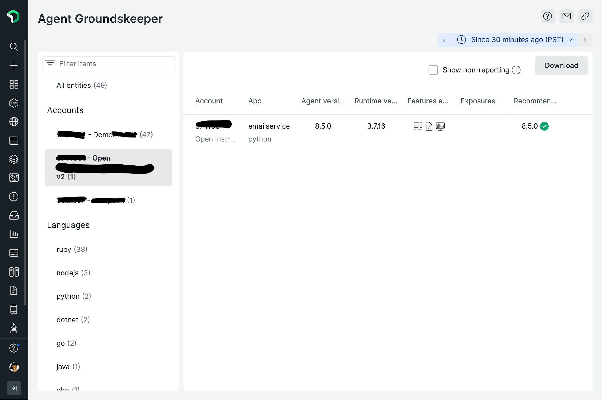

# Agent Groundskeeper v2

## What's new

We’ve updated Agent Groundskeeper to improve user experience to be able to identify out-of-date APM agents and help organize your agent upgrades.

Improvements include

- Identifying whether your currently deployed Application - APM Agent versions contain any critical exposures 
- Quickly understand what capabilities are currently enabled for your Application
- Recommendations for which agent version to upgrade to based on your runtime per Application. Highlighting if you are already at the latest recommended version, if your runtime is out of support and if there is no supported APM Agent version for your runtime. 
- Quickly and easily zoom in on your environment by filtering on tags and searching by account, language and tags.
- Download the application list for project planning

